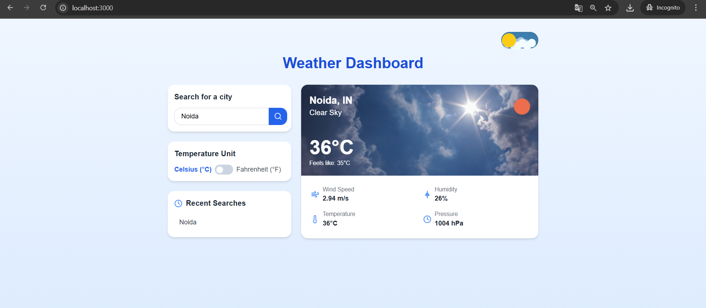
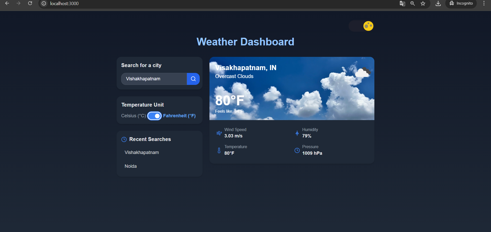

# 🌦️ Weather Dashboard

A responsive weather dashboard built with **React**, **Express**, and the **OpenWeatherMap API**, allowing users to fetch real-time weather information by city name. The app features live data, unit toggling, recent searches, a modern UI with dark/light mode toggle, and animated weather-based backgrounds.

---

## 🖼️ Preview




---

## ✨ Features

- 🔍 Search weather by city name
- 🌡️ View:
  - Temperature (Celsius or Fahrenheit)
  - Weather condition (e.g., Rain, Clear, Clouds)
  - Wind speed
  - Humidity and pressure
  - Icon-based condition visualization
- 🎥 Weather-specific animated video backgrounds
- 🌗 Dark/light theme toggle
- 🔄 Toggle units between Celsius and Fahrenheit
- 💾 Saves recent searches (localStorage)
- ⚙️ Built with:
  - React (Functional components + Hooks)
  - Context API for global weather state
  - Express server with Axios for API calls
  - TailwindCSS for styling
  - Vercel for frontend deployment (optional)
  - Render or Railway for backend deployment (recommended)

---

## 🚀 How to Run Locally

> Make sure you have **Node.js** and **npm** installed.

1. **Download or Clone** the repository:
   - Download ZIP or run:
     ```bash
     git clone https://github.com/your-username/your-repo.git
     ```

2. **Navigate to the root project directory**:
   ```bash
   cd Weather-Dashboard-main
   ```
3. **Run commands**:
   ```bash
   npm run install-all
   ```
   ```bash
   npm run dev
   ```
